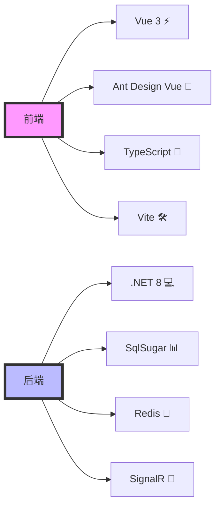
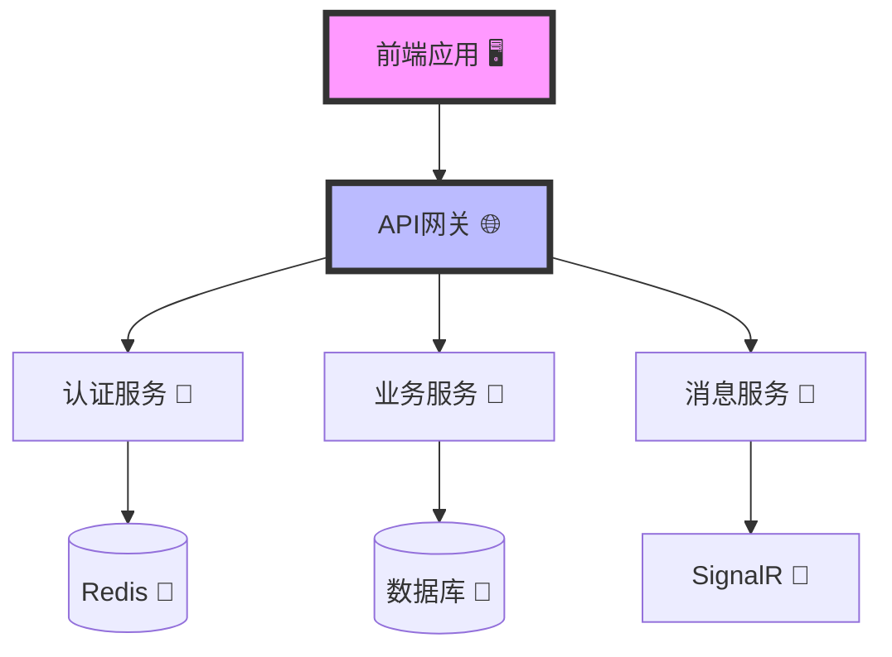
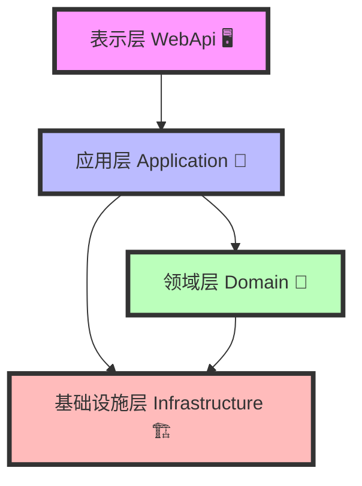

# 🎯 黑冰台代码生成管理系统 (Lean.Hbt)

## 📚 目录

- [项目简介](#-项目简介)
  - [技术栈](#-技术栈)
- [系统架构](#️-系统架构)
  - [整体架构](#-整体架构)
  - [DDD分层架构](#-ddd分层架构)
- [开发环境](#-开发环境)
  - [必需工具](#-必需工具)
  - [推荐工具](#-推荐工具)
  - [IDE配置](#-ide配置)
- [快速开始](#-快速开始)
  - [环境准备](#-环境准备)
  - [安装步骤](#-安装步骤)
  - [基础配置](#-基础配置)
  - [运行命令](#-运行命令)
- [项目结构](#-项目结构)
  - [后端结构](#-后端结构)
  - [前端结构](#-前端结构)
- [核心功能](#-核心功能模块)
  - [权限管理](#-权限管理模块)
  - [代码生成器](#️-代码生成器模块)
  - [工作流引擎](#-工作流引擎模块)
  - [实时通信](#-实时通信模块)
- [数据库设计](#-数据库设计)
  - [核心表结构](#-核心表结构)
  - [初始化脚本](#-初始化脚本)
- [API文档](#-api文档)
  - [接口规范](#-接口规范)
  - [认证授权](#-认证授权)
- [前端开发](#-前端开发)
  - [主题设计](#主题设计规范)
  - [开发流程](#-开发流程)
- [开发规范](#-开发规范)
  - [命名规范](#-命名规范)
  - [代码风格](#-代码风格)
- [部署指南](#-部署指南)
  - [Docker部署](#-docker部署流程)
  - [环境配置](#️-环境配置)
- [贡献指南](#-贡献指南)
- [许可证](#-许可证)

## 💫 项目简介

黑冰台是一个基于 .NET 8 的现代化代码生成管理系统，采用领域驱动设计(DDD)架构，集成了权限管理、代码生成、工作流等核心功能模块。

### 🚀 技术栈



#### 🔧 后端技术
- 🎯 框架: .NET 8
- 📊 ORM: SqlSugar
- ⚡ 缓存: Redis
- 📡 实时通信: SignalR
- 🔐 认证授权: JWT + Identity Server 4
- 📚 API文档: Swagger/OpenAPI

#### 🎨 前端技术
- ⚡ 框架: Vue 3
- 🎨 UI组件: Ant Design Vue
- 🛠️ 构建工具: Vite
- 📝 开发语言: TypeScript
- 📦 状态管理: Pinia
- 🌐 HTTP客户端: Axios

## 🏗️ 系统架构

### 📐 整体架构



### 🔄 DDD分层架构



## 📂 项目结构

```
Lean.Hbt/
├── backend/                  # 💻 后端项目
│   ├── src/                 # 📦 源代码
│   │   ├── Domain/         # 💎 领域层
│   │   │   ├── Entities/   # 📋 实体
│   │   │   ├── Events/     # 📢 领域事件
│   │   │   ├── Services/   # 🔧 领域服务
│   │   │   └── Repositories/ # 📦 仓储接口
│   │   ├── Application/    # 📱 应用层
│   │   │   ├── Services/   # 🔧 应用服务
│   │   │   ├── Dtos/      # 📄 数据传输对象
│   │   │   ├── Interfaces/ # 📋 接口定义
│   │   │   └── AutoMapper/ # 🔄 对象映射
│   │   ├── Infrastructure/ # 🏗️ 基础设施层
│   │   │   ├── Persistence/ # 💾 持久化
│   │   │   ├── Identity/   # 🔐 身份认证
│   │   │   ├── Logging/    # 📝 日志
│   │   │   └── Common/     # 🔧 公共组件
│   │   ├── Common/         # 🔧 公共层
│   │   │   ├── Constants/  # 📋 常量定义
│   │   │   ├── Enums/      # 📊 枚举定义
│   │   │   ├── Extensions/ # 🔌 扩展方法
│   │   │   ├── Helpers/    # 🛠️ 帮助类
│   │   │   ├── Models/     # 📦 通用模型
│   │   │   └── Utils/      # 🔧 工具类
│   │   └── WebApi/        # 🌐 接口层
│   │       ├── Controllers/ # 🎮 控制器
│   │       ├── Filters/    # 🔍 过滤器
│   │       ├── Middlewares/ # 🔗 中间件
│   │       └── Extensions/  # 🔌 扩展方法
│   ├── tools/              # 🛠️ 工具和脚本
│   └── docs/               # 📚 API文档
├── frontend/               # 🎨 前端项目
│   ├── src/               # 📦 源代码
│   │   ├── api/          # 🌐 API接口
│   │   ├── assets/       # 🖼️ 静态资源
│   │   ├── components/   # 🧩 公共组件
│   │   ├── composables/  # 🎣 组合式函数
│   │   ├── config/      # ⚙️ 配置文件
│   │   ├── layouts/     # 📐 布局组件
│   │   ├── router/      # 🗺️ 路由配置
│   │   ├── store/       # 📦 状态管理
│   │   ├── styles/      # 🎨 样式文件
│   │   ├── types/       # 📝 类型定义
│   │   ├── utils/       # 🛠️ 工具函数
│   │   └── views/       # 📄 页面组件
│   └── public/          # 📁 公共资源
├── docker/               # 🐳 Docker配置
│   ├── backend/         # 💻 后端Docker配置
│   └── frontend/        # 🎨 前端Docker配置
├── scripts/             # 📜 部署脚本
├── .editorconfig        # ⚙️ 编辑器配置
├── .gitignore          # 🚫 Git忽略文件
├── docker-compose.yml   # 🐳 Docker编排配置
└── README.md           # 📖 项目说明
```

## 💎 核心功能模块

### 🔐 权限管理模块

#### 1. 用户认证
- 🔑 JWT Token认证
- 🔄 OAuth2.0/OpenID Connect集成
- 👤 统一身份认证中心(Identity Server 4)
- 🔒 单点登录(SSO)支持

#### 2. 权限控制
- 👥 RBAC角色权限模型
- 🏢 多租户支持
- 🔍 数据权限控制
- 🚦 API访问控制
- 🎯 按钮级权限控制

#### 3. 组织架构
- 📊 多级组织结构
- 👥 用户组管理
- 📋 岗位管理
- 🔄 组织关系维护

#### 4. 安全特性
- 🔒 密码策略管理
- 🚫 登录限制策略
- 📝 操作日志审计
- ⚡ 实时会话管理

### ⚙️ 代码生成器模块

#### 1. 模板引擎
- 📋 Scriban模板引擎
- 🎨 自定义模板支持
- 🔄 模板版本管理
- 📝 在线模板编辑

#### 2. 数据源管理
- 💾 多数据库支持
- 📊 表结构解析
- 🔗 关联关系分析
- 📋 字段映射配置

#### 3. 代码生成
- 💻 领域模型生成
- 📝 数据传输对象生成
- 🔧 仓储层代码生成
- 🎮 控制器代码生成
- 🎨 前端代码生成

#### 4. 生成策略
- ⚙️ 命名规则配置
- 🎯 字段类型映射
- 🔄 覆盖策略设置
- 📋 代码注释生成

### 🔄 工作流引擎模块

#### 1. 流程设计
- 📊 可视化流程设计器
- 📋 流程模板管理
- 🎯 节点类型配置
- 🔗 流程连线规则

#### 2. 流程管理
- 📝 流程定义管理
- 🚀 流程实例管理
- 📊 流程监控统计
- 🔍 流程历史查询

#### 3. 任务处理
- 📋 待办任务管理
- 📝 任务处理接口
- 🔄 任务转交/委托
- 📊 任务统计分析

#### 4. 高级特性
- 🔄 并行处理支持
- 🎯 条件分支控制
- ⏱️ 定时任务集成
- 📊 业务数据关联

### 📡 实时通信模块

#### 1. SignalR集成
- 🔌 实时消息推送
- 👥 在线用户管理
- 🔄 自动重连机制
- 📊 连接状态监控

#### 2. 消息管理
- 📨 系统通知推送
- 💬 即时消息通信
- 📊 消息统计分析
- 📝 消息历史记录

### 🎨 前端功能

#### 1. 主题定制
- 🎨 动态主题切换
- 📱 响应式布局
- 🌓 暗黑模式支持
- 🔧 主题变量配置

#### 2. 组件封装
- 📊 高级表格组件
- 📝 表单生成器
- 📊 图表组件
- 🔍 高级搜索组件

#### 3. 状态管理
- 📦 Pinia状态管理
- 💾 持久化存储
- 🔄 数据同步机制
- 🔍 状态追踪

## 💻 开发环境

### 🛠️ 必需工具
- Visual Studio 2022+ (17.8.0+)
- .NET 8 SDK (8.0.0+)
- Node.js (18.0.0+)
- SQL Server 2019+/MySQL 8.0+
- Redis 6.0+

### 🔧 推荐工具
- Visual Studio Code
- Azure Data Studio
- Postman/Apifox
- Git GUI工具

### ⚙️ IDE配置
- EditorConfig
- C# Dev Kit
- Vue Language Features
- TypeScript Vue Plugin
- ESLint + Prettier

## 🚀 快速开始

### 📋 环境准备
1. 安装必需工具
2. 配置开发环境
3. 准备数据库
4. 配置Redis

### 📥 安装步骤
```bash
# 克隆项目
git clone https://github.com/Lean365/Lean.Hbt.git

# 后端依赖
cd backend
dotnet restore

# 前端依赖
cd ../frontend
pnpm install
```

### ⚙️ 基础配置
1. 配置数据库连接
2. 配置Redis连接
3. 配置JWT密钥
4. 配置跨域设置

### 🎮 运行命令
```bash
# 启动后端
cd backend/src/WebApi
dotnet run

# 启动前端
cd frontend
pnpm dev
```

## 💾 数据库设计

### 📊 核心表结构
```sql
-- 用户表
CREATE TABLE Hbt_User (
    Id BIGINT PRIMARY KEY,
    Username NVARCHAR(50) NOT NULL,
    -- 其他字段
);

-- 角色表
CREATE TABLE Hbt_Role (
    Id BIGINT PRIMARY KEY,
    RoleName NVARCHAR(50) NOT NULL,
    -- 其他字段
);

-- 更多核心表...
```

### 📜 初始化脚本
1. 数据库创建脚本
2. 基础数据初始化
3. 测试数据初始化

## 📚 API文档

### 📋 接口规范
- 接口版本：v1
- 基础路径：/api/hbt
- 认证方式：Bearer Token
- 响应格式：统一返回结构

### 🔐 认证授权
- 获取Token：POST /api/hbt/auth/token
- 刷新Token：POST /api/hbt/auth/refresh
- 注销Token：POST /api/hbt/auth/logout

## 🤝 贡献指南

1. 🔄 Fork 项目
2. 📝 创建特性分支
3. 💻 提交代码
4. 🎯 发起合并请求

## 📄 许可证

[MIT License](LICENSE)

## 📏 开发规范

### 📝 命名规范

#### 1. 后端命名规范 (C#)
- 帕斯卡命名法(PascalCase)：
  - 实体类：`public class HbtUser`
    - 必须以 `Hbt` 开头，如：`HbtRole`, `HbtPermission`
  - 控制器：`public class HbtUserController`
    - 必须以 `Hbt` 开头，以 `Controller` 结尾
  - 服务接口：`public interface IHbtUserService`
    - 必须以 `IHbt` 开头，以 `Service` 结尾
  - 服务实现：`public class HbtUserService`
    - 必须以 `Hbt` 开头，以 `Service` 结尾
  - 仓储接口：`public interface IHbtUserRepository`
    - 必须以 `IHbt` 开头，以 `Repository` 结尾
  - 仓储实现：`public class HbtUserRepository`
    - 必须以 `Hbt` 开头，以 `Repository` 结尾
  - 工具类：`public class HbtStringUtils`
    - 必须以 `Hbt` 开头，以 `Utils` 结尾
  - 扩展类：`public static class HbtStringExtensions`
    - 必须以 `Hbt` 开头，以 `Extensions` 结尾
  - 特性类：`public class HbtAuthAttribute`
    - 必须以 `Hbt` 开头，以 `Attribute` 结尾
  - 枚举类：`public enum HbtUserStatus`
    - 必须以 `Hbt` 开头，表示业务含义
  - 常量类：`public static class HbtConstants`
    - 必须以 `Hbt` 开头，以 `Constants` 结尾
  - 配置类：`public class HbtJwtOptions`
    - 必须以 `Hbt` 开头，以 `Options` 或 `Settings` 结尾
  - DTO类：`public class HbtUserDto`
    - 必须以 `Hbt` 开头，以 `Dto` 结尾
  - 查询类：`public class HbtUserQuery`
    - 必须以 `Hbt` 开头，以 `Query` 结尾
  - 命令类：`public class HbtCreateUserCommand`
    - 必须以 `Hbt` 开头，以 `Command` 结尾
  - 事件类：`public class HbtUserCreatedEvent`
    - 必须以 `Hbt` 开头，以 `Event` 结尾

- 驼峰命名法(camelCase)：
  - 私有字段：`private string _userName;`
  - 方法参数：`void UpdateUser(int userId)`
  - 局部变量：`var userCount = 0;`
- 特殊规则：
  - 异步方法必须以Async结尾：`GetDataAsync()`
  - 布尔属性/变量应该是问句：`IsActive`, `HasPermission`
  - 集合属性应使用复数形式：`Users`, `OrderItems`

#### 2. 前端命名规范 (Vue3 + TypeScript)
- 文件命名：
  - 组件文件：`PascalCase.vue`
    - 示例：`UserProfile.vue`, `LoginForm.vue`
  - 路由页面：`PascalCase.vue`
    - 示例：`UserList.vue`, `RoleManagement.vue`
  - 工具文件：`camelCase.ts`
    - 示例：`httpClient.ts`, `dateUtils.ts`
  - 类型文件：`PascalCase.type.ts`
    - 示例：`User.type.ts`, `Response.type.ts`
  - 样式文件：`kebab-case.scss`
    - 示例：`main-layout.scss`, `theme-dark.scss`

- 组件命名：
  - 组件名：使用PascalCase
    ```typescript
    export default defineComponent({
      name: 'UserProfile',
    })
    ```
  - Props：使用camelCase
    ```typescript
    const props = defineProps<{
      userId: number;
      userName: string;
    }>()
    ```
  - Emits：使用kebab-case
    ```typescript
    const emit = defineEmits<{
      'update:modelValue': [value: string];
      'status-change': [status: boolean];
    }>()
    ```

- 变量命名：
  - Ref/Reactive：使用camelCase
    ```typescript
    const userName = ref('');
    const userState = reactive({
      id: 0,
      name: '',
    });
    ```
  - 方法：使用camelCase
    ```typescript
    const handleSubmit = () => {};
    const fetchUserData = async () => {};
    ```

- CSS命名(BEM规范)：
  ```scss
  .block {
    &__element {
      &--modifier {}
    }
  }
  // 示例
  .user-card {
    &__avatar {
      &--large {}
    }
    &__name {
      &--bold {}
    }
  }
  ```

- Store命名(Pinia)：
  ```typescript
  // store/modules/userStore.ts
  export const useUserStore = defineStore('user', {
    state: () => ({
      userInfo: null,
      permissions: [],
    }),
    actions: {
      async fetchUserInfo() {},
    },
  });
  ```

- API接口命名：
  ```typescript
  // api/modules/userApi.ts
  export const userApi = {
    getUserInfo: () => request.get('/api/user/info'),
    updateUserProfile: (data: UserProfile) => 
      request.put('/api/user/profile', data),
  };
  ```

- 类型定义：
  ```typescript
  // types/user.type.ts
  export interface UserInfo {
    id: number;
    userName: string;
    email: string;
  }

  export type UserRole = 'admin' | 'user' | 'guest';
  ```

#### 3. 命名空间约束
- 所有项目必须以 `Lean.Hbt` 开头
- 模块命名规范：
  - 领域层：`Lean.Hbt.Domain.{Module}`
  - 应用层：`Lean.Hbt.Application.{Module}`
  - 基础设施层：`Lean.Hbt.Infrastructure.{Module}`
  - Web API层：`Lean.Hbt.WebApi`

#### 4. 数据库约束
- 表名前缀：`Hbt_`
  - 示例：`
```

### 📄 文件头和注释规范

#### 1. 文件头规范
所有源代码文件(.cs, .vue, .ts等)必须包含统一的文件头:
```csharp
//===================================================================
// 项目名 : Lean.Hbt 
// 文件名 : {文件名} 
// 创建者 : {作者}
// 创建时间: {yyyy-MM-dd} {HH:mm}
// 版本号 : V1.0.0
// 描述    : {文件用途简要说明}
//===================================================================
```

#### 2. 代码注释规范

##### C#代码注释
- 类注释:
```csharp
/// <summary>
/// 类功能描述
/// </summary>
/// <remarks>
/// 创建者: {作者}
/// 创建时间: {yyyy-MM-dd}
/// 最后修改者: {最后修改人}
/// 最后修改时间: {yyyy-MM-dd}
/// </remarks>
public class HbtUser
{
}
```

- 属性注释:
```csharp
/// <summary>
/// 属性说明
/// </summary>
/// <value>可能的值说明</value>
public string UserName { get; set; }
```

- 方法注释:
```csharp
/// <summary>
/// 方法功能描述
/// </summary>
/// <param name="参数名">参数说明</param>
/// <returns>返回值说明</returns>
/// <exception cref="异常类型">可能抛出的异常说明</exception>
public async Task<bool> UpdateUserAsync(int userId)
{
}
```

##### TypeScript/Vue代码注释
- 组件注释:
```typescript
/**
 * 组件功能描述
 * @author 作者
 * @date 创建时间
 * @update 最后修改时间
 */
export default defineComponent({
})
```

- 方法注释:
```typescript
/**
 * 方法功能描述
 * @param {参数类型} 参数名 - 参数说明
 * @returns {返回类型} 返回值说明
 */
const handleSubmit = () => {
}
```

#### 3. 注释规范要求
- 所有**公开**的类、接口、方法和属性必须有中文注释
- 复杂的私有方法应该有注释
- 特别复杂的代码块应该有注释
- 注释应该说明代码的作用、重要参数以及返回值
- 注释应该解释代码的业务含义，而不是重复代码的内容
- 及时更新注释，确保注释与代码的一致性
- 删除注释掉的代码，不要将注释掉的代码提交到版本库

#### 4. 注释示例
```csharp
/// <summary>
/// 用户服务接口
/// </summary>
public interface IHbtUserService
{
    /// <summary>
    /// 根据用户ID获取用户信息
    /// </summary>
    /// <param name="userId">用户ID</param>
    /// <returns>用户信息</returns>
    /// <exception cref="HbtNotFoundException">用户不存在时抛出此异常</exception>
    Task<HbtUserDto> GetUserByIdAsync(long userId);

    /// <summary>
    /// 创建新用户
    /// </summary>
    /// <param name="createDto">用户创建信息</param>
    /// <returns>新创建的用户ID</returns>
    /// <exception cref="HbtValidationException">输入验证失败时抛出此异常</exception>
    /// <exception cref="HbtDuplicateException">用户名重复时抛出此异常</exception>
    Task<long> CreateUserAsync(HbtCreateUserDto createDto);
}
```

### 📦 公共包引用

#### 基础组件
- Newtonsoft.Json (13.0.3) - JSON序列化/反序列化
- SqlSugar (5.1.4.172) - ORM框架
- EPPlus (7.5.2) - Excel导入导出
- NLog (5.3.4) - 日志记录
- Quartz (3.13.1) - 任务调度
- SkiaSharp (3.116.1) - 图形处理

#### 缓存组件
- StackExchange.Redis (2.8.24) - Redis缓存
- Microsoft.Extensions.Caching.Memory (8.0.1) - 内存缓存

#### 认证授权
- Microsoft.AspNetCore.Authentication.JwtBearer (8.0.1) - JWT认证
- IdentityServer4 (4.1.2) - 身份认证服务器

#### 通信组件
- Microsoft.AspNetCore.SignalR (1.1.0) - 实时通信
- RabbitMQ.Client (6.8.1) - 消息队列

#### 工具组件
- Mapster (7.4.0) - 对象映射
- FluentValidation (11.9.0) - 数据验证
- Swashbuckle.AspNetCore (6.5.0) - Swagger接口文档

## 全局规范

### 1. 序列化规范

- **JSON序列化**: 全局统一使用 Newtonsoft.Json 进行序列化和反序列化
  ```csharp
  // 配置示例
  services.AddControllers()
      .AddNewtonsoftJson(options =>
      {
          // 日期格式化
          options.SerializerSettings.DateFormatString = "yyyy-MM-dd HH:mm:ss";
          // 忽略循环引用
          options.SerializerSettings.ReferenceLoopHandling = ReferenceLoopHandling.Ignore;
          // 忽略空值
          options.SerializerSettings.NullValueHandling = NullValueHandling.Ignore;
          // 使用驼峰命名
          options.SerializerSettings.ContractResolver = new CamelCasePropertyNamesContractResolver();
      });
  ```
  - 禁止使用 System.Text.Json
  - 所有项目统一使用相同的序列化配置
  - API 接口返回数据必须使用 Newtonsoft.Json 序列化

### 2. 日志规范

- **日志框架**: 全局统一使用 NLog 记录日志
  ```xml
  <!-- nlog.config 配置示例 -->
  <?xml version="1.0" encoding="utf-8" ?>
  <nlog xmlns="http://www.nlog-project.org/schemas/NLog.xsd"
        xmlns:xsi="http://www.w3.org/2001/XMLSchema-instance"
        autoReload="true">
    <targets>
      <!-- 文件日志 -->
      <target xsi:type="File" name="allfile" 
              fileName="${basedir}/logs/${shortdate}.log"
              layout="${longdate}|${event-properties:item=EventId_Id:whenEmpty=0}|${uppercase:${level}}|${logger}|${message} ${exception:format=tostring}" />
      
      <!-- 控制台日志 -->
      <target xsi:type="Console" name="lifetimeConsole" 
              layout="${MicrosoftConsoleLayout}" />
    </targets>

    <rules>
      <!-- 记录所有日志 -->
      <logger name="*" minlevel="Trace" writeTo="allfile" />
      <!-- 控制台输出 -->
      <logger name="Microsoft.Hosting.Lifetime" minlevel="Info" writeTo="lifetimeConsole" />
    </rules>
  </nlog>
  ```
  
  - 日志级别规范：
    - Trace: 追踪信息，用于开发调试
    - Debug: 调试信息，可输出详细的程序运行状态
    - Info: 一般信息，记录程序正常运行状态
    - Warn: 警告信息，潜在的问题或即将出现的问题
    - Error: 错误信息，程序发生错误但不影响运行
    - Fatal: 致命错误，导致程序无法继续运行的错误

  - 日志记录规范：
    - 必须记录所有异常信息
    - 必须记录关键业务操作
    - 必须记录系统启动和关闭
    - 必须记录用户登录和注销
    - 必须记录数据库和缓存操作异常
    - 必须记录第三方接口调用信息

  - 日志格式规范：
    - 时间戳必须精确到毫秒
    - 必须包含日志级别
    - 必须包含类名和方法名
    - 必须包含线程ID
    - 异常日志必须包含完整的堆栈信息
    - 必须包含追踪ID用于分布式追踪
