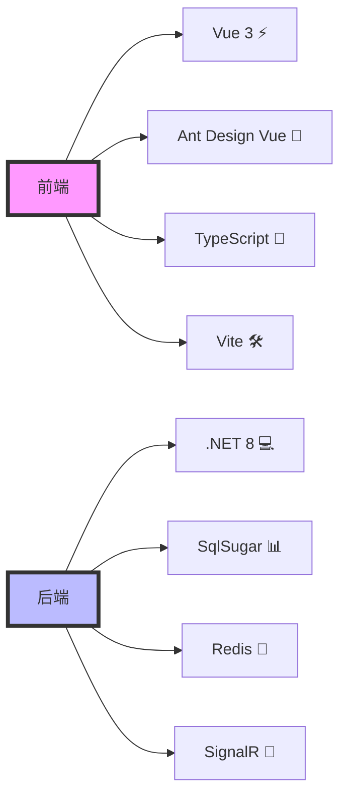
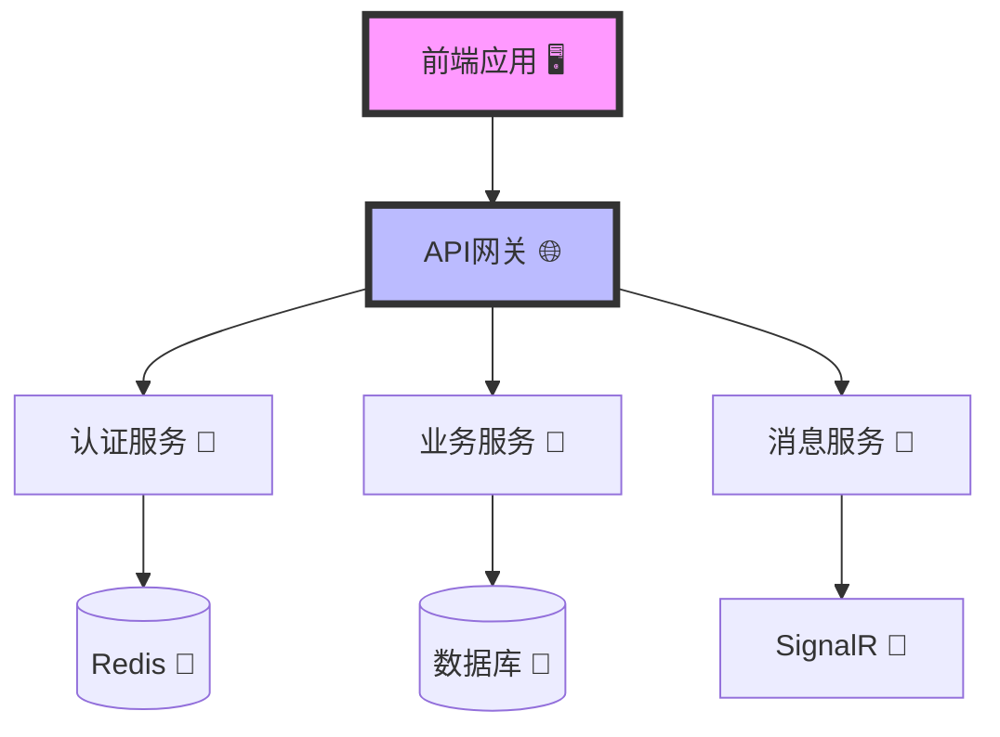
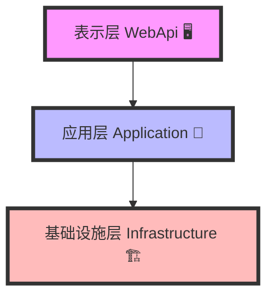

# 🎯 黑冰台代码生成管理系统 (Lean.Hbt)

## 📚 目录

- [项目简介](#-项目简介)
  - [技术栈](#-技术栈)
- [系统架构](#️-系统架构)
  - [整体架构](#-整体架构)
  - [DDD分层架构](#-ddd分层架构)
- [开发环境](#-开发环境)
  - [必需工具](#-必需工具)
  - [推荐工具](#-推荐工具)
  - [IDE配置](#-ide配置)
- [快速开始](#-快速开始)
  - [环境准备](#-环境准备)
  - [安装步骤](#-安装步骤)
  - [基础配置](#-基础配置)
  - [运行命令](#-运行命令)
- [项目结构](#-项目结构)
  - [后端结构](#-后端结构)
  - [前端结构](#-前端结构)
- [核心功能](#-核心功能模块)
  - [权限管理](#-权限管理模块)
  - [代码生成器](#️-代码生成器模块)
  - [工作流引擎](#-工作流引擎模块)
  - [实时通信](#-实时通信模块)
- [数据库设计](#-数据库设计)
  - [核心表结构](#-核心表结构)
  - [初始化脚本](#-初始化脚本)
- [API文档](#-api文档)
  - [接口规范](#-接口规范)
  - [认证授权](#-认证授权)
- [前端开发](#-前端开发)
  - [主题设计](#主题设计规范)
  - [开发流程](#-开发流程)
- [开发规范](#-开发规范)
  - [命名规范](#-命名规范)
  - [代码风格](#-代码风格)
- [部署指南](#-部署指南)
  - [Docker部署](#-docker部署流程)
  - [环境配置](#️-环境配置)
- [贡献指南](#-贡献指南)
- [许可证](#-许可证)
- [🔒 代码审查和分支保护规则](#-代码审查和分支保护规则)
  - [📋 强制审查范围](#-强制审查范围)
  - [🎯 审查重点](#-审查重点)
  - [🌿 分支管理](#-分支管理)
  - [🤖 自动化检查](#-自动化检查)
  - [📚 文档要求](#-文档要求)

## 💫 项目简介

黑冰台是一个基于 .NET 8 的现代化代码生成管理系统，集成了权限管理、代码生成、工作流等核心功能模块。

### 🚀 技术栈



#### 🔧 后端技术
- 🎯 框架: .NET 8
- 📊 ORM: SqlSugar
- ⚡ 缓存: Redis
- 📡 实时通信: SignalR
- 🔐 认证授权: JWT + Identity Server 4
- 📚 API文档: Swagger/OpenAPI

#### 🎨 前端技术
- ⚡ 框架: Vue 3
- 🎨 UI组件: Ant Design Vue
- 🛠️ 构建工具: Vite
- 📝 开发语言: TypeScript
- 📦 状态管理: Pinia
- 🌐 HTTP客户端: Axios

## 🏗️ 系统架构

### 📐 整体架构



### 🔄 分层架构



## 📂 项目结构

```
Lean.Hbt/
├── backend/                  # 💻 后端项目
│   ├── src/                 # 📦 源代码
│   │   ├── Application/    # 📱 应用层
│   │   │   ├── Services/   # 🔧 应用服务
│   │   │   ├── Dtos/      # 📄 数据传输对象
│   │   │   └── Interfaces/ # 📋 接口定义
│   │   ├── Infrastructure/ # 🏗️ 基础设施层
│   │   │   ├── Persistence/ # 💾 持久化
│   │   │   ├── Identity/   # 🔐 身份认证
│   │   │   ├── Logging/    # 日志
│   │   ├── Common/         # 🔧 公共层
│   │   │   ├── Constants/  # 📋 常量定义
│   │   │   ├── Enums/      # 📊 枚举定义
│   │   │   ├── Extensions/ # 🔌 扩展方法
│   │   │   ├── Helpers/    # 🛠️ 帮助类
│   │   │   ├── Models/     # 📦 通用模型
│   │   │   └── Utils/      # 🔧 工具类
│   │   └── WebApi/        # 🌐 接口层
│   │       ├── Controllers/ # 🎮 控制器
│   │       ├── Filters/    # 🔍 过滤器
│   │       ├── Middlewares/ # 🔗 中间件
│   │       └── Extensions/  # 🔌 扩展方法
│   ├── tools/              # 🛠️ 工具和脚本
│   └── docs/               # 📚 API文档
├── frontend/               # 🎨 前端项目
│   ├── src/               # 📦 源代码
│   │   ├── api/          # 🌐 API接口
│   │   ├── assets/       # 🖼️ 静态资源
│   │   ├── components/   # 🧩 公共组件
│   │   ├── composables/  # 🎣 组合式函数
│   │   ├── config/      # ⚙️ 配置文件
│   │   ├── layouts/     # 📐 布局组件
│   │   ├── router/      # 🗺️ 路由配置
│   │   ├── store/       # 📦 状态管理
│   │   ├── styles/      # 🎨 样式文件
│   │   ├── types/       # 📝 类型定义
│   │   ├── utils/       # 🛠️ 工具函数
│   │   └── views/       # 📄 页面组件
│   └── public/          # 📁 公共资源
├── docker/               # 🐳 Docker配置
│   ├── backend/         # 💻 后端Docker配置
│   └── frontend/        # 🎨 前端Docker配置
├── scripts/             # 📜 部署脚本
├── .editorconfig        # ⚙️ 编辑器配置
├── .gitignore          # 🚫 Git忽略文件
├── docker-compose.yml   # 🐳 Docker编排配置
└── README.md           # 📖 项目说明
```

## 💎 核心功能模块

### 🔐 权限管理模块

#### 1. 用户认证
- 🔑 JWT Token认证
- 🔄 OAuth2.0/OpenID Connect集成
- 👤 统一身份认证中心(Identity Server 4)
- 🔒 单点登录(SSO)支持

#### 2. 权限控制
- 👥 RBAC角色权限模型
- 🏢 多租户支持
- 🔍 数据权限控制
- 🚦 API访问控制
- 🎯 按钮级权限控制

#### 3. 组织架构
- 📊 多级组织结构
- 👥 用户组管理
- 📋 岗位管理
- 🔄 组织关系维护

#### 4. 安全特性
- 🔒 密码策略管理
- 🚫 登录限制策略
- 📝 操作日志审计
- ⚡ 实时会话管理

### ⚙️ 代码生成器模块

#### 1. 模板引擎
- 📋 Scriban模板引擎
- 🎨 自定义模板支持
- 🔄 模板版本管理
- 📝 在线模板编辑

#### 2. 数据源管理
- 💾 多数据库支持
- 📊 表结构解析
- 🔗 关联关系分析
- 📋 字段映射配置

#### 3. 代码生成
- 💻 实体模型生成
  - 引用实体基类
- 📝 数据传输对象生成
  - CRUD对象
  - 导入导出DTO对象
  - 特定DTO对象
- 🔧 仓储层代码生成
  - 仓储接口
  - 仓储实现
- 🔨 服务层代码生成
  - 服务接口
  - 服务实现
- 🎮 控制器代码生成
- 🎨 前端代码生成
  - API接口文件
  - 多语言翻译文件
  - 列表页面(基于Ant Design Vue)
    - 查询表单
    - 数据表格
    - 新增/编辑表单
    - 详情页面
  - 导入/导出功能

#### 4. 生成策略
- ⚙️ 命名规则配置
- 🎯 字段类型映射
- 🔄 覆盖策略设置
- 📋 代码注释生成

### 🔄 工作流引擎模块

#### 1. 流程设计
- 📊 可视化流程设计器
- 📋 流程模板管理
- 🎯 节点类型配置
- 🔗 流程连线规则

#### 2. 流程管理
- 📝 流程定义管理
- 🚀 流程实例管理
- 📊 流程监控统计
- 🔍 流程历史查询

#### 3. 任务处理
- 📋 待办任务管理
- 📝 任务处理接口
- 🔄 任务转交/委托
- 📊 任务统计分析

#### 4. 高级特性
- 🔄 并行处理支持
- 🎯 条件分支控制
- ⏱️ 定时任务集成
- 📊 业务数据关联

### 📡 实时通信模块

#### 1. SignalR集成
- 🔌 实时消息推送
- 👥 在线用户管理
- 🔄 自动重连机制
- 📊 连接状态监控

#### 2. 消息管理
- 📨 系统通知推送
- 💬 即时消息通信
- 📊 消息统计分析
- 📝 消息历史记录

### 🎨 前端功能

#### 1. 主题定制
- 🎨 动态主题切换
- 📱 响应式布局
- 🌓 暗黑模式支持
- 🔧 主题变量配置

#### 2. 组件封装
- 📊 高级表格组件
- 📝 表单生成器
- 📊 图表组件
- 🔍 高级搜索组件

#### 3. 状态管理
- 📦 Pinia状态管理
- 💾 持久化存储
- 🔄 数据同步机制
- 🔍 状态追踪

### 🌐 多语言支持
- 前端多语言
  - 基于 Vue-i18n 实现
  - 模块化的语言包管理
  - 动态语言切换
  - [前端多语言开发规范](docs/standards/frontend/i18n/i18n-standards.md)

- 后端多语言
  - 基于中间件实现语言切换
  - 统一的异常消息国际化
  - 数据验证消息国际化
  - 业务消息国际化
  - [后端多语言开发规范](docs/standards/backend/i18n/i18n-standards.md)

## 💻 开发环境

### 🛠️ 必需工具
- Visual Studio 2022+ (17.8.0+)
- .NET 8 SDK (8.0.0+)
- Node.js (18.0.0+)
- SQL Server 2019+/MySQL 8.0+
- Redis 6.0+

### 🔧 推荐工具
- Visual Studio Code
- Azure Data Studio
- Postman/Apifox
- Git GUI工具

### ⚙️ IDE配置
- EditorConfig
- C# Dev Kit
- Vue Language Features
- TypeScript Vue Plugin
- ESLint + Prettier

## 🚀 快速开始

### 📋 环境准备
1. 安装必需工具
2. 配置开发环境
3. 准备数据库
4. 配置Redis

### 📥 安装步骤
```bash
# 克隆项目
git clone https://github.com/Lean365/Lean.Hbt.git

# 后端依赖
cd backend
dotnet restore

# 前端依赖
cd ../frontend
pnpm install
```

### ⚙️ 基础配置
1. 配置数据库连接
2. 配置Redis连接
3. 配置JWT密钥
4. 配置跨域设置

### 🎮 运行命令
```bash
# 启动后端
cd backend/src/WebApi
dotnet run

# 启动前端
cd frontend
pnpm dev
```

## 💾 数据库设计

### 📊 核心表结构
```sql
-- 用户表
CREATE TABLE Hbt_User (
    Id BIGINT PRIMARY KEY,
    Username NVARCHAR(50) NOT NULL,
    -- 其他字段
);

-- 角色表
CREATE TABLE Hbt_Role (
    Id BIGINT PRIMARY KEY,
    RoleName NVARCHAR(50) NOT NULL,
    -- 其他字段
);

-- 更多核心表...
```

### 📜 初始化脚本
1. 数据库创建脚本
2. 基础数据初始化
3. 测试数据初始化

## 📚 API文档

### 📋 接口规范
- 接口版本：v1
- 基础路径：/api/hbt
- 认证方式：Bearer Token
- 响应格式：统一返回结构

### 🔐 认证授权
- 获取Token：POST /api/hbt/auth/token
- 刷新Token：POST /api/hbt/auth/refresh
- 注销Token：POST /api/hbt/auth/logout

## 🔒 代码审查和分支保护规则

### 📋 强制审查范围

以下变更必须经过代码审查和批准才能合并:

1. 字段命名变更
   - 🏷️ 实体类中的字段名称
   - 📊 数据库表和列名
   - 📦 DTO对象的属性名
   - 🎨 前端组件的数据属性名

2. CRUD操作变更
   - ➕ 增删改查方法的实现
   - 🔍 查询条件和排序规则
   - 📄 分页逻辑
   - ✅ 数据验证规则
   - 📤 返回结果格式

3. 导入导出功能变更
   - 📑 Excel导入导出模板
   - 🔄 数据映射规则
   - 📁 文件处理逻辑
   - ✔️ 数据验证规则
   - 📊 进度反馈机制

### 🎯 审查重点

1. 命名规范
   - 📝 遵循项目统一的命名约定
   - 🔄 保持前后端字段命名一致性
   - 📊 确保数据库命名规范

2. 代码一致性
   - 🔄 CRUD实现必须遵循统一模式
   - 📤 导入导出必须使用统一的工具类
   - ❌ 异常处理必须统一
   - 📝 日志记录必须规范

3. 性能考虑
   - 🚀 查询优化
   - 📦 批量操作效率
   - 💾 内存使用控制
   - 🔄 并发处理

### 🌿 分支管理

1. 保护分支
   - 🔒 master分支受保护,禁止直接推送
   - 📥 所有更改通过Pull Request提交
   - ✅ 至少需要一名审查者批准
   - 🔄 CI检查必须通过

2. 开发流程
   - 🌿 从master创建feature分支
   - 📝 完成开发后提交Pull Request
   - ✅ 通过代码审查后合并到master
   - 🧹 定期清理已合并的分支

### 🤖 自动化检查

1. 代码质量检查
   - 📝 命名规范检查
   - 🎨 代码格式检查
   - 🔍 重复代码检查
   - 📊 圈复杂度检查

2. 测试要求
   - ✅ 单元测试覆盖
   - 🔄 集成测试通过
   - 🚀 性能测试达标

### 📚 文档要求

1. 更新文档
   - 📖 API文档同步更新
   - 📊 数据库设计文档更新
   - 📝 更新日志记录
   - 📖 使用说明更新

2. 注释要求
   - 📝 类和方法必须有中文注释
   - 💡 关键业务逻辑必须注释
   - 📊 复杂算法必须详细注释

## 贡献指南

1. 🔄 Fork 项目
2. 📝 创建特性分支
3. 💻 提交代码
4. 🎯 发起合并请求

## 📄 许可证

[MIT License](LICENSE)

### 📦 公共包引用

#### 基础组件
- Newtonsoft.Json (13.0.3) - JSON序列化/反序列化
- SqlSugar (5.1.4.172) - ORM框架
- EPPlus (7.5.2) - Excel导入导出
- NLog (5.3.4) - 日志记录
- Quartz (3.13.1) - 任务调度
- SkiaSharp (3.116.1) - 图形处理

#### 缓存组件
- StackExchange.Redis (2.8.24) - Redis缓存
- Microsoft.Extensions.Caching.Memory (8.0.1) - 内存缓存

#### 认证授权
- Microsoft.AspNetCore.Authentication.JwtBearer (8.0.1) - JWT认证
- IdentityServer4 (4.1.2) - 身份认证服务器

#### 通信组件
- Microsoft.AspNetCore.SignalR (1.1.0) - 实时通信
- RabbitMQ.Client (6.8.1) - 消息队列

#### 工具组件
- Mapster (7.4.0) - 对象映射
- FluentValidation (11.9.0) - 数据验证
- Swashbuckle.AspNetCore (6.5.0) - Swagger接口文档

## 全局规范

### 1. 序列化规范

- **JSON序列化**: 全局统一使用 Newtonsoft.Json 进行序列化和反序列化
  ```csharp
  // 配置示例
  services.AddControllers()
      .AddNewtonsoftJson(options =>
      {
          // 日期格式化
          options.SerializerSettings.DateFormatString = "yyyy-MM-dd HH:mm:ss";
          // 忽略循环引用
          options.SerializerSettings.ReferenceLoopHandling = ReferenceLoopHandling.Ignore;
          // 忽略空值
          options.SerializerSettings.NullValueHandling = NullValueHandling.Ignore;
          // 使用驼峰命名
          options.SerializerSettings.ContractResolver = new CamelCasePropertyNamesContractResolver();
      });
  ```
  - 禁止使用 System.Text.Json
  - 所有项目统一使用相同的序列化配置
  - API 接口返回数据必须使用 Newtonsoft.Json 序列化

## 📚 开发规范文档

### 前端规范
- [Vue组件开发规范](docs/standards/frontend/component-standards.md) - 全局通用
- [Vue页面开发规范](docs/standards/frontend/page-standards.md) - 全局通用
- [TypeScript开发规范](docs/standards/frontend/typescript-standards.md) - 全局通用
- [API接口规范](docs/standards/frontend/api-standards.md) - 全局通用
- [多语言开发规范](docs/standards/frontend/i18n-standards.md) - 全局通用

## 后端开发规范

后端开发规范包含以下内容：

- ✅ [C#代码规范](docs/standards/backend/code-style.md) - 包含命名规范、代码格式、编码实践等完整规范
- 🚧 [控制器开发规范](docs/standards/backend/controller-standards.md) - 全局通用
- 🚧 [服务层开发规范](docs/standards/backend/service-standards.md) - 开发中
- 🚧 [仓储层开发规范](docs/standards/backend/repository-standards.md) - 全局通用
- 🚧 [实体开发规范](docs/standards/backend/entity-standards.md) - 开发中
- 🚧 [异常处理规范](docs/standards/backend/exception-standards.md) - 全局通用
- 🚧 [日志实现规范](docs/standards/backend/logging-standards.md) - 全局通用
- 🚧 [命名规范](docs/standards/backend/naming-standards.md) - 全局通用
- 🚧 [DTO对象开发规范](docs/standards/backend/dto-standards.md) - 全局通用
